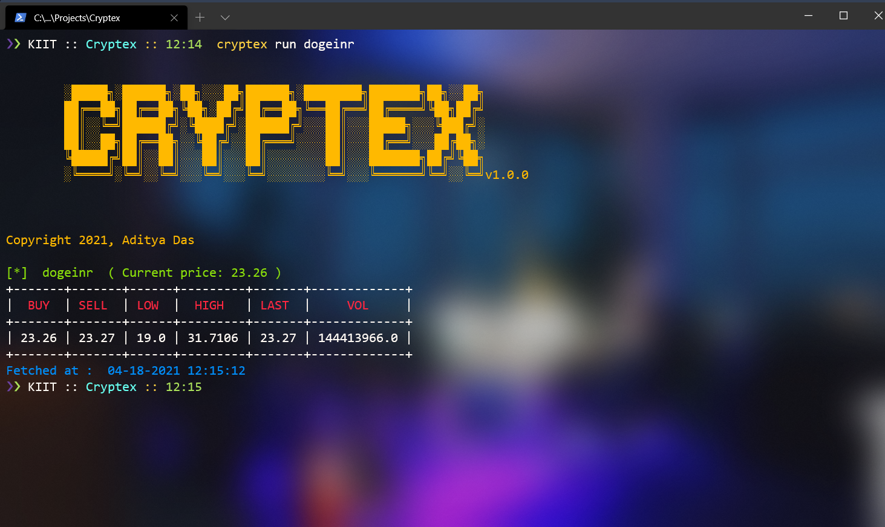

<div align="center">
	
</div>

# _**Cryptex**_  
A command line *Crypto-currency ticker* made using golang and Wazirx Api.
<br/>
<div align="center">
	
</div>

## Installation

```
- go install
```

## Usage

```
- cryptex [command]
```

## Available Commnads

```
 - help        Help about any command
 - list        lists all the supported coins by this CLI
 - run         runs the cli
 - version     Version Details
```

## Example

```
❯❯ ADITYA :: Cryptex :: 12:25  cryptex run btcinr


        ░█████╗░██████╗░██╗░░░██╗██████╗░████████╗███████╗██╗░░██╗
        ██╔══██╗██╔══██╗╚██╗░██╔╝██╔══██╗╚══██╔══╝██╔════╝╚██╗██╔╝
        ██║░░╚═╝██████╔╝░╚████╔╝░██████╔╝░░░██║░░░█████╗░░░╚███╔╝░
        ██║░░██╗██╔══██╗░░╚██╔╝░░██╔═══╝░░░░██║░░░██╔══╝░░░██╔██╗░
        ╚█████╔╝██║░░██║░░░██║░░░██║░░░░░░░░██║░░░███████╗██╔╝╚██╗
        ░╚════╝░╚═╝░░╚═╝░░░╚═╝░░░╚═╝░░░░░░░░╚═╝░░░╚══════╝╚═╝░░╚═╝v1.0.0


Copyright 2021, Aditya Das

[*]  btcinr  ( Current price: 4699399.0 )
+-----------+-----------+-----------+-----------+-----------+----------+
|    BUY    |   SELL    |    LOW    |   HIGH    |   LAST    |   VOL    |
+-----------+-----------+-----------+-----------+-----------+----------+
| 4699399.0 | 4712946.0 | 4665608.0 | 4988519.0 | 4712946.0 | 600.7997 |
+-----------+-----------+-----------+-----------+-----------+----------+
Fetched at :  04-18-2021 12:25:16
```

## License

_Copyright 2021 [Aditya Das](https://github.com/ThatOneTallKid)_ <br/>
Under Apache-2.0 license

[](https://forthebadge.com)
[](https://forthebadge.com)
[](https://forthebadge.com)
